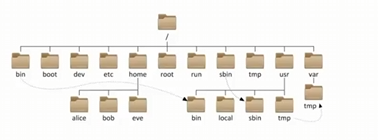

# 1.1Linux结构目录

---
## 1.1.1 Linux路径

**Windows：使用\表示层级关系
Linux：使用/表示层级关系（/在Linux系统中☞根目录，也☞当前目录）


**eg：** 在根目录下有一个文件夹test，文件夹内有hello.txt
   **回答：** ==/test/hello.txt==

# 1.2 Linux命令入门
--- 
## 1.2.1命令基础格式
```linux
命令 [-选项] [参数]
```
## 1.2.2 ls命令

```Linux
ls [-a -l -h] [Linux路径]
```
**功能：** ==列出当前目录下的内容== （终端默认工作区为用户home目录）
**参数：** -a  all的意思，列出全部文件（包含隐藏文件/文件夹）
       -l    以竖向列表形式展示，并且展示更多信息
       


